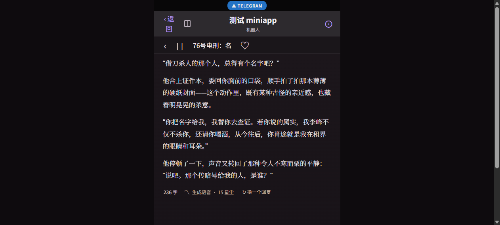

# 语音生成收费与 300 字限制

## 基本信息

- **功能名：** 语音生成收费、300 字硬限制与文本处理服务调整
- **优先级：** T1（Trellis 任务优先级 P1）
- **负责人：** PRD：经年｜开发：WHC｜跟进：经年｜体验终审：浅灰 / 经年
- **发布验证环境：** 测试环境
- **需求来源：** `0825 MiniApp 语音付费与 300 字限制.md`

## 目标与用户价值

语音能力进入付费阶段后，每次成功生成或重新生成角色语音收取 15 星尘，并在用户操作前明确展示价格。同时，将最终实际发送给语音模型的文本限制在 300 字以内；不满足长度要求或生成失败的请求必须在相应阶段停止且不扣费，避免用户为无结果请求付费，也避免产生无效的语音模型成本。

## 背景与已确认事实

- 当前聊天页已提供角色消息级“生成语音”、失败重试、重新生成、紧凑播放条、“本次语音文字”展示及自定义语音文字入口。
- 默认生成和自定义生成都会先经过文本处理，再调用语音模型；文本处理可能改变原始内容长度，因此不能只校验角色原回复或用户初始输入。
- 本需求不增加二次确认框，扣费与长度控制应融入现有消息级语音交互。
- 文本处理模型继续使用 DeepSeek V4 Flash，但需切换到用户指定的兼容服务；服务地址和凭据属于服务端安全配置。

## 需求范围

### R1. 单次语音收费与价格展示

1. 每次成功“生成语音”收取 **15 星尘**。
2. 同一条角色消息重新生成语音视为一次新生成；每次成功均再次收取 **15 星尘**，不复用上一轮收费结果。
3. 角色回复底部的“生成语音”入口旁显示“15 星尘”，与回复字数及重新生成入口保持同一行紧凑排版。
4. 不增加聊天顶部入口或扣费二次确认框。
5. 用户发起生成时需先检查星尘余额；余额少于 15 星尘时不可进入文本处理或语音生成流程，并沿用产品现有的余额不足引导。
6. 扣费时点为语音生成成功后。文本处理成功或语音模型请求已发出均不等同于可扣费结果。

### R2. 默认生成的 300 字硬限制

1. 默认生成时，文本处理提示必须明确要求最终输出不超过 300 字。
2. 无论文本处理模型是否遵守提示，在真正调用语音模型前都必须再次校验处理后的最终文本。
3. 只有最终实际发送给语音模型的文本不超过 300 字时，才允许继续生成。
4. 最终文本超过 300 字时，应在语音模型调用前拦截。

### R3. 自定义生成的 300 字硬限制

1. 自定义输入框最多允许输入 300 字，超过部分不允许写入，用户不能输入第 301 个字。
2. 自定义文本仍须经过既有文本处理流程。
3. 文本处理完成后，必须按最终实际发送给语音模型的文本再次执行 300 字校验，不能仅凭用户初始输入长度放行。
4. 自定义文本的最终处理结果超过 300 字时，与默认生成采用相同的拦截和不扣费规则。

### R4. 超限提示与状态恢复

1. 最终文本超过 300 字时，不调用语音模型、不扣星尘。
2. 在当前角色消息底部、“生成语音”入口下方显示一行紧凑红色小字：

   > 文字处理后的语音文本超过 300 字，请删减或缩改后再生成

3. 超限提示只影响当前角色消息，不弹窗、不遮挡聊天内容或输入框，其他消息不受影响。
4. 当前消息下一次成功生成，或重新进入正常可生成状态后，超限提示消失。
5. 视觉效果以随任务保存的效果图为验收参考：

   

### R5. 失败处理与不扣费规则

1. 文本处理调用失败时，不调用语音模型、不扣星尘，并在当前角色消息底部提示本次未生成。
2. 语音模型余额不足、生成超时或其他语音生成失败时，不扣星尘。
3. 失败后当前消息恢复“生成语音”或“重试语音”的可操作状态，并提示用户可重试。
4. 重新发起后仅在新的语音成功生成时收费。
5. 任一消息的失败或超限状态不得影响其他聊天消息的展示和语音操作。

### R6. 文本处理服务调整与安全约束

1. DeepSeek V4 Flash 继续承担语音文本处理职责，并切换到用户指定的兼容服务地址。
2. 兼容服务地址及凭据只允许保存在服务端安全配置中，不得下发至 MiniApp。
3. API Key、私有地址或密钥不得明文进入客户端代码、产品文档、交互原型或日志。
4. 文本处理提示中的 300 字约束不能替代调用语音模型前的最终服务端校验。

### R7. 现有语音体验保持不变

1. 已生成语音继续使用现有紧凑播放条。
2. “本次语音文字”继续默认展开。
3. 自定义入口继续位于现有语音文字框内。
4. 本次不改变现有音色选择、播放控制和语音文字展示位置。

## 统一流程与扣费判定

1. 用户点击生成或重新生成。
2. 校验用户至少拥有 15 星尘；不足则终止，不进入上游调用且不扣费。
3. 调用文本处理服务生成最终语音文本。
4. 文本处理失败则终止并提示，不调用语音模型、不扣费。
5. 校验最终语音文本长度；超过 300 字则终止并展示行内超限提示，不调用语音模型、不扣费。
6. 调用语音模型。
7. 语音模型失败、余额不足或超时则恢复可重试状态，不扣费。
8. 语音生成成功后扣除 15 星尘并展示现有播放及语音文字界面。

## 验收标准

- [ ] **AC1 价格可见：** 任一可生成语音的角色消息底部均在“生成语音”入口旁显示“15 星尘”，排版与现有字数和重新生成入口协调，无二次确认框。
- [ ] **AC2 首次生成收费：** 余额充足时，默认生成完成文本处理及最终长度校验后调用语音模型；成功后余额准确减少 15 星尘，并展示可播放语音。
- [ ] **AC3 重新生成收费：** 同一条消息每次重新生成成功后均再次准确减少 15 星尘，并更新为本次生成结果。
- [ ] **AC4 余额前置校验：** 余额少于 15 星尘时不可发起文本处理或语音模型调用，余额不变，并向用户展示现有余额不足引导。
- [ ] **AC5 默认生成超限：** 默认文本处理结果超过 300 字时，语音模型未被调用、余额不变，当前消息显示指定红色行内提示。
- [ ] **AC6 默认生成边界：** 最终文本恰好为 300 字时允许调用语音模型；301 字时必须拦截。
- [ ] **AC7 自定义输入硬限制：** 自定义输入达到 300 字后无法继续输入第 301 个字，粘贴超长内容时超过部分不写入。
- [ ] **AC8 自定义处理后二次校验：** 自定义初始输入不超过 300 字、但处理结果超过 300 字时，语音模型未被调用、余额不变，并显示与默认生成一致的超限提示。
- [ ] **AC9 文本处理失败：** 文本处理调用失败时，语音模型未被调用、余额不变，当前消息提示本次未生成并恢复可重试状态。
- [ ] **AC10 语音生成失败：** 语音模型余额不足、超时或其他调用失败时余额不变，当前消息恢复可重试状态；再次发起并成功后才扣除 15 星尘。
- [ ] **AC11 提示生命周期：** 超限提示仅出现在当前消息；当前消息下一次成功生成或恢复正常状态后提示消失，其他聊天不受影响。
- [ ] **AC12 安全性：** MiniApp 构建产物、客户端请求、产品文档与应用日志中均不存在文本处理服务密钥或私有地址明文。
- [ ] **AC13 回归体验：** 已生成语音的播放条、“本次语音文字”默认展开、自定义入口位置、音色和播放控制保持原有行为。
- [ ] **AC14 测试环境验证：** 测试环境能够客观核对每次请求是否调用文本处理、是否调用语音模型、是否扣除 15 星尘，以及失败/超限时余额是否保持不变。

## 明确不做

- 不增加不同字数档位、动态价格、会员折扣或包月套餐。
- 不增加语音退款入口。
- 不改变音色、播放条、语音文字默认展示和自定义入口的位置。
- 不在聊天顶部增加语音入口。
- 不增加扣费二次确认框。
- 不在客户端、PRD 或原型中记录任何真实服务密钥、私有地址或调用凭据。

## 依赖、风险与待实施前输入

- **服务配置依赖：** 工程实施前需取得目标 DeepSeek 兼容服务的地址和凭据，并通过服务端安全配置注入；PRD 与任务附件不保存真实值。
- **扣费一致性风险：** “语音成功”与“扣除 15 星尘”必须形成可验证的一次性业务结果，避免并发点击、重复回调或重试导致重复扣费；具体一致性方案在技术设计阶段确定。
- **字符计数一致性风险：** 前后端必须使用一致的 300 字计数规则，确保 300/301 边界在输入限制与最终服务端校验中结论一致；具体实现口径在技术设计阶段结合现有文本处理规则确认。
- **发布决策：** 全部测试通过后由经年确认；确认上线则进入生产环境，暂不上线则保留测试环境继续观察付费提示、失败拦截与扣费结果。

## 规划状态

- 当前仅完成需求 PRD，任务保持 `planning` 状态。
- 用户确认本 PRD 后，再进入技术设计、执行计划、任务拆分及实现阶段。
