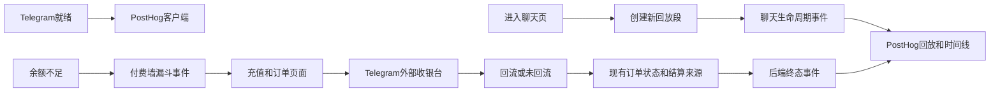

# 用户行为回放系统：技术设计

## 1. 最小充分方案

在 `packages/frontend` 集成 `posthog-js`，仅在聊天路由活动时手动创建 Session Replay；由余额不足离开聊天的录制延续至充值、订单结果和邀请页。显式前端事件与支付结算后的服务端终态事件共同补足回放无法可靠推断的节点。PostHog 原生检索、回放、播放控制和时间线是本期唯一运营入口；不建运营后台、回放播放器、事件中转服务或分析数据库。

支付仍由现有 Backend 订单和结算链路作为真相源。前端记录用户可见的选择、跳转与回流，Backend 在既有幂等结算后异步记录订单终态；两者按同一 Telegram 用户 ID 与订单 ID 关联，不改变支付结算。



## 2. 边界、身份和数据契约

### 2.1 前端 telemetry 边界

- 新增一个浏览器端 PostHog adapter（拟放 `packages/frontend/src/lib/telemetry/`），以及挂在根 `Providers` 的 replay lifecycle owner。前者负责初始化、身份、session recording、事件校验和安全降级，后者拥有跨路由的单一 flow 状态；业务页面/hook 只能调用它们暴露的窄接口。
- SDK 在 Telegram 用户就绪后初始化。公开配置只允许 `NEXT_PUBLIC_POSTHOG_KEY` 与经校验的 HTTPS `NEXT_PUBLIC_POSTHOG_HOST`；它们是浏览器公开配置，不得误称为 secret。缺失/非法配置时 adapter 为 no-op，并记录不含用户正文的本地/Sentry 失败摘要。
- `distinct_id` 使用字符串化 Telegram 用户 ID，与现有 Sentry 身份一致；不将完整 initData、内部数据库行或 raw launch URL 作为身份/属性。
- 每次进入聊天页生成 `replay_context_id` 并开始全新 recording（PostHog 当前文档支持 `startSessionRecording(false)`）。正常离开聊天页与明确 idle timeout（**15 分钟**；仅在无输入/点击/滚动/可见活动且不在流式生成时计时；`external_payment_pending` 不计 idle）结束 context；但余额不足触发的内部跳转会保留同一个 context，持续覆盖充值、订单结果和邀请页。外部支付可能造成 pagehide/新 WebView，允许产生多个 PostHog recording；所有片段以 `replay_context_id`、订单 ID 和 identity 关联，不能承诺物理上是一段连续录像。
- 采用显式 capture，不打开依赖 DOM 文本的通用 autocapture 作为业务事实来源。回放负责还原画面；事件负责检索、分类和跳转。
- 现有 Sentry Session Replay 维持现状（含当前采样与 `maskAllText: false`）。需求方已接受双录制：PostHog 是本期产品检索通道，Sentry Replay 继续承担既有排障；本期不关闭、不降采样、不替换 Sentry Replay。

### 2.2 对外事件契约

PostHog 是外部数据消费者，因此新增的事件名、必填/可选属性、枚举和值域必须先定义在 `packages/shared/src/api/`，再由 frontend adapter 和 Backend 支付终态 adapter 消费。拟新增 `telemetry.ts`，只暴露 browser-safe Zod schema/type，不暴露数据库 row、凭据、支付地址或消息正文。`PaymentOrder` 同时兼容扩展 `settled_by`，让订单详情和列表使用同一事实。

公共关联字段：

- `telegram_user_id`、`replay_context_id`、`occurred_at`；
- 聊天事件附带 `character_id`、`conversation_session_id`、`selected_model_id`；
- 支付事件附带 `order_id`、`payment_type`、`order_status`、兼容扩展后的 `settled_by` 和已知阶段耗时；
- 用户标签：`is_paid_user`、`total_chat_rounds`。其值必须来自受鉴权的最小 context DTO，不能从前端猜测或直接读数据库。本期不做 `user_cohort`。

事件正文禁止携带 user input、assistant content、`pay_url`、支付表单数据、完整 initData、headers、token、secret 和任意错误 response body。聊天正文仅按需求例外留在录制画面中。

### 2.3 事件字典

| 域         | 事件                                                                                                        | 必要结果属性                                                           |
| ---------- | ----------------------------------------------------------------------------------------------------------- | ---------------------------------------------------------------------- |
| 聊天回放   | `replay_chat_started` / `replay_chat_ended`                                                                 | 结束原因：`route_change`、`pagehide`、`idle_timeout`、`unload_unknown` |
| 对话       | `chat_turn_started` / `chat_stream_opened` / `chat_turn_completed` / `chat_turn_failed`                     | turn/revision、持续时间、`failure_kind`（不含服务端正文）              |
| 重生成     | `chat_regeneration_requested` / `chat_regeneration_completed` / `chat_regeneration_failed`                  | turn/revision、持续时间、失败类别                                      |
| 付费墙     | `paywall_triggered` / `paywall_dismissed` / `paywall_invite_selected` / `paywall_recharge_selected`         | 触发源、所需星尘（若有）、停留时长                                     |
| 充值       | `recharge_viewed` / `payment_method_selected` / `payment_order_created` / `external_payment_open_requested` | 套餐 ID、方式、order ID；不得带金额以外的支付 URL                      |
| 回流       | `payment_return_observed` / `payment_order_status_observed` / `payment_flow_left_observed`                  | order status、`settled_by`、回流标记、最后已观测动作、阶段耗时         |
| 服务端终态 | `payment_order_settled` / `payment_order_failed`                                                            | order status、`settled_by`、order ID；仅在既有订单状态写入后异步发送   |
| SDK 健康   | `replay_sdk_init_failed` / `replay_recording_failed`                                                        | 已枚举的安全失败代码，不带异常消息                                     |

`payment_flow_left_observed` 只表示浏览器端最后观察到 pending flow，不能表示支付失败或最终放弃。PostHog 中的 `abandoned` 仅可定义为：相同 order ID在约定观察窗口内有离开事件、没有后续继续事件，且没有服务端成功/失败终态事件。服务端成功优先于先前的离开事件；`expired` 不能单独作为最终失败，因为现有支付链路可重开迟到付款订单。

## 3. 隐私与安全设计

### 3.1 批准的例外

2026-09-15 隐私责任人已批准：用户输入和模型回复完整显示在 Session Replay 画面中，以检查内容质量和 Markdown 呈现。例外覆盖 PostHog Session Replay 与现有 Sentry Session Replay。frontend spec 已同步受控例外。事件、日志和错误上报仍不得携带聊天正文。书面记录见 `research/t1-decision-record.md`。

### 3.2 必须屏蔽的内容

- 支付密码、账号、验证码、银行卡/支付账号等输入字段必须加 PostHog `ph-no-capture`（或经官方文档确认的等效 browser-side 屏蔽）并设为输入全局遮罩；支付敏感第三方内容无法屏蔽时，在展示前暂停 recording。
- 完整 initData、`pay_url`、支付 query 参数和任何 token/secret 不得出现在录制 URL、DOM 文本或事件属性中。实施时将目前订单等待页 URL 中的 `pay_url` 改为同 tab 的短生命周期受控存储，或在不能安全改造时停止/重启 recording 以确保其不出现在录制中。
- 支持客服和不属于 paywall flow 的个人资料页面不在本期 recording 范围；自定义语音页只在从聊天 context 进入时录制，充值、订单结果和邀请页仅在从本次聊天付费墙延续的 context 中录制。不得因为 SDK 在全局初始化而自动录制它们。
- 使用 PostHog 官方的 browser-side mask/block 配置和真实录制验证；`sanitizeTelemetry` 只可作为 Sentry/log 辅助，不能替代 PostHog 的 DOM/属性屏蔽。Sentry Replay 的现有屏蔽策略本期不改。

### 3.3 治理要求

- PostHog 使用 **US Cloud**。访问限于产品与工程。访问审计责任人与到期删除责任人与隐私责任人同一人。保留策略为当前套餐上限到期自动删除：**当前 Free 套餐最长 30 天**，不得写成 60 天。项目级 DPA/30 天开关/套餐截图互证在 T7 完成，未完成不得生产启用。
- 事件与 replay URL 的访问只能授予排障/内容优化所需角色；包含完整聊天内容的导出、共享和下载按同一审批约束处理。
- 不采集网络请求正文或授权 header。开启任何 PostHog network/console recording 前，必须独立安全评审，不属于本期默认范围。

## 4. 用户标签来源

现有浏览器安全 DTO 只能提供付费时间，不能完整提供付费状态和累计轮数，因此新增一个最小只读 context：

```text
GET /api/telemetry/replay-context
→ telegram_user_id, is_paid_user, total_chat_rounds
```

- route 使用 `requireTelegramAuth`；响应契约先入 shared，不能返回内部 user UUID、订单明细或数据库 row。
- `is_paid_user` 由服务端已完成订单的权威状态计算；`total_chat_rounds` 由现有用户/会话事实源计算，不在前端累计。
- `user_cohort` 本期跳过（后期精细化检索）。契约与 context API 均不包含该字段。
- context 只在聊天回放开始时和必要的身份/模型变更时读取；失败不会阻断 replay，会以缺失的可选标签安全降级并留下健康事件。

## 5. 可靠性、并发与性能

- PostHog SDK 动态加载一次；初始化/发送失败不抛给页面，不阻塞 `telegramReady`、React Query、SSE、router 或支付回跳。
- lifecycle owner 对 replay 启停和关键事件进行串行/幂等保护，防止 React Strict Mode、重复 effect 或快速路由切换创建重叠 recording；页面卸载时不把关键事实写入 best-effort event。
- 流式回复不对每个 `delta` 打点，只记录开始、首个可见流事件、完成和失败，避免高频上报影响渲染和成本。
- 订单状态可能在 webhook、return、query、cron 中异步落库：客户端只在观察到服务端状态改变时记录事件；Backend 在既有 completed/failed 状态持久化后以短超时、非关键调用补发终态，按 `order_id + status + settled_by` 去重，终态后停止轮询和重复打点。
- 不为分析新增同步阻塞请求。context 请求设置明确短超时且不自动无限重试；安全可重试的 GET 只使用有限退避。
- 对 SDK 初始化、recording 开始/停止、事件丢弃/失败添加匿名化 counters 和 request/replay context 摘要，不记录内容；由现有 Sentry/Pino 体系观察，不新建日志管道。

## 6. 兼容、发布与恢复

1. 先合并 shared 事件/context/订单兼容契约和 Backend 只读 context、支付终态 adapter，保持现有消费者兼容。
2. 再部署 Backend，确认 context 未影响支付和对话接口，且 PostHog 失败不影响支付结算。
3. 最后部署 Frontend，保留现有 Sentry Session Replay（含 error/performance），并在 test 环境以 100% 手动录制启用 PostHog，验证真实 WebView 与外部支付回流。
4. 生产仅在隐私批准、当前套餐上限内的到期删除（**Free：30 天**）、100% 项目级采样和屏蔽证据齐备后启用。双录制是已接受的成本/暴露面：PostHog 负责产品检索与付费墙证据，Sentry Replay 继续承担既有排障；本期不关闭、不降采样、不替换 Sentry Replay。

回滚是关闭/移除 PostHog 的公开配置或受控采集开关，不回滚聊天、订单或结算业务数据。若事件字典有误，优先兼容新增事件/属性并停用错误事件；已发送 replay 依 PostHog 删除与保留流程处理，不在应用端伪造删除成功。
