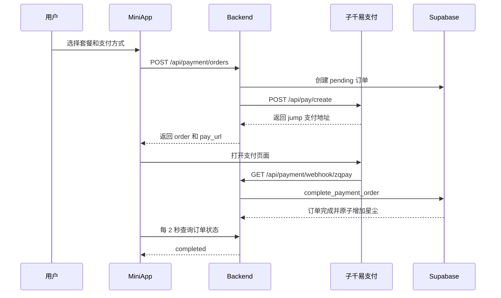

# MiniApp 子千易支付 V2 接入说明

## 1. 改造目标

本次改造将已停用的 JLPay 支付网关替换为子千易支付 V2，同时恢复支付宝支付入口。

改造范围严格限制在支付渠道接入层：

- 使用子千易 V2 RSA 接口创建支付订单。
- 首版固定使用普通跳转支付 `method=jump`。
- 支持微信支付 `wxpay` 和支付宝 `alipay`。
- 使用新的异步通知地址 `/api/payment/webhook/zqpay`。
- 保留现有套餐、订单状态、订单表、支付中页面、轮询和星尘到账事务。

未实现二维码、URL Scheme 直拉、JSAPI、小程序插件、退款、关闭订单、自定义进件商户和自定义通道。

## 2. 整体支付链路



## 3. 子千易 V2 网关

实现文件：

- `packages/backend/src/infrastructure/payment/ZqPaymentGateway.ts`

下单接口：

```text
POST {PAYMENT_BASE_URL}/api/pay/create
Content-Type: application/x-www-form-urlencoded
```

核心请求参数：

- `pid`：商户 ID。
- `method=jump`：固定使用普通页面跳转支付。
- `type`：`wxpay` 或 `alipay`。
- `out_trade_no`：MiniApp 本地订单号。
- `notify_url`：异步支付通知地址。
- `return_url`：支付完成后的同步回跳地址。
- `name`：商品名称。
- `money`：人民币元，保留两位小数。
- `clientip`：用户发起支付的 IP。
- `param`：当前用户 ID。
- `timestamp`：10 位秒级时间戳。
- `sign_type=RSA`。
- `sign`：商户 RSA 私钥生成的签名。

签名规则：

1. 排除 `sign`、`sign_type`、空值。
2. 参数名按 ASCII 升序排列。
3. 拼接为 `key=value&key=value`。
4. 使用 `RSA-SHA256` 和商户私钥签名，结果使用 Base64。

密钥解析同时兼容：

- 完整 PEM 文本。
- 没有 PEM 头尾的 Base64 内容。
- Railway 中使用 `\n` 保存的多行密钥。

### 下单响应处理

只接受：

- `code=0`。
- `pay_type=jump`。
- `pay_info` 是合法的 HTTP 或 HTTPS 地址。

子千易当前真实下单成功响应不包含 `sign`、`sign_type` 和 `timestamp`，因此实现策略为：

- 响应携带 `sign` 时，必须使用平台公钥验签。
- 响应未携带 `sign` 时，继续严格检查 `code`、`pay_type` 和跳转 URL。
- 响应携带错误签名时，仍然拒绝下单。

这一兼容仅适用于创建订单响应，支付异步回调仍然强制 RSA 验签。

## 4. 下单与订单状态

实现文件：

- `packages/backend/src/features/payment/usecases/RechargeUseCase.ts`
- `packages/backend/src/infrastructure/repositories/MiniappPaymentOrderRepository.ts`

下单步骤：

1. 检查 `PAYMENT_ENABLED`。
2. 从运行时配置读取并校验套餐。
3. 生成 `MA_{userId}_{timestamp}_{random}` 格式的订单号。
4. 向 `miniapp.payment_orders` 写入 `pending` 订单。
5. 调用子千易统一下单接口。
6. 成功时返回现有契约 `{ order, pay_url }`。
7. 渠道创建失败时将订单标记为 `failed`。

订单状态模型保持不变：

```text
pending -> completed
pending -> expired
pending -> failed
```

订单有效期仍为 15 分钟。订单详情和订单列表仍会处理已超时的 pending 订单。

## 5. 支付异步回调

实现文件：

- `packages/backend/src/routes/payment.ts`

回调地址：

```text
GET  /api/payment/webhook/zqpay
POST /api/payment/webhook/zqpay   （application/x-www-form-urlencoded，仅容错）
```

厂商《支付结果通知》文档写明请求方式是 **GET**，POST 一条只是容错（易支付系各分支实现不一，
上一版 JLPay 接入就注册了两条），成本为零。

后端依次校验：

1. 商户订单号 `out_trade_no` 存在。
2. `pid` 与当前商户 ID 一致。
3. 平台公钥验签通过。`sign` 必须存在；`sign_type` 缺失时按 RSA 验，带了但不是 RSA 时拒绝——
   安全边界是「公钥能验通签名」，不是「字面量等于 RSA」。
4. `timestamp` **仅在回调携带时**校验（10 位且与服务器时间相差不超过 10 分钟）。
   厂商文档把它列为通知字段，但下单响应同样文档有、实测无（见 0ce6eb2），
   所以按「带了才校验」处理；防重放由 RSA 验签和 `credits_added` 幂等承担。
5. `trade_status=TRADE_SUCCESS`。
6. 本地订单存在。
7. 回调金额与本地订单金额精确到分一致。

前四步的拒绝会打 `payment.webhook.verify_failed`，带 `reason`
（`missing_order_id` / `merchant_mismatch` / `invalid_signature` / `stale_timestamp`）
和回调字段名列表（只记字段名，不记值），用于区分「厂商没发某字段」和「签名真的不对」。

验证通过后调用数据库函数 `miniapp.complete_payment_order`：

- 将订单更新为 `completed`。
- 写入平台订单号 `trade_no`。
- 更新支付完成时间。
- 将主星尘和赠送星尘加入用户钱包。
- 写入钱包流水。
- 使用数据库行锁和 `credits_added` 保证重复回调不会重复入账。

处理成功返回纯文本：

```text
success
```

验证或处理失败返回：

```text
fail
```

首次完成订单后会写入“星尘充值到账”站内通知，重复回调不会重复创建通知。

### 迟到回调的补账

`complete_payment_order` 只接受 `pending` 订单，而订单详情和订单列表会把超过 15 分钟的
pending 订单翻成 `expired`。因此回调晚于 15 分钟到达时，已验签的成功回调会先把订单
（`status=expired` 且 `credits_added=false`）放回 `pending` 再入账，并打
`payment.webhook.expired_order_reopened`。没有这一步，用户付了钱而星尘永久拿不到。

## 6. 同步回跳

同步回跳接口保持为：

```text
GET /api/payment/return
```

导航行为不变：

- 参数验签通过且订单号合法时，回到对应订单详情页。
- 参数无效时，回到订单列表页。
- Telegram 环境优先通过 `startapp=payment_return_{orderId}` 回到 MiniApp。
- 非 Telegram 环境回到前端 `/profile/recharge/{orderId}`。

**但同步回跳现在也会入账。** 厂商《支付结果通知》文档的第一行写明通知类型是
「服务器异步通知（`notify_url`）、页面跳转通知（`return_url`）」，两条的参数和签名完全相同
（都带 `trade_status`、`money`、`trade_no`、`sign`、`sign_type`）。而 2026-08-21 的真机支付实测：
`/api/payment/return` 被打中两次，`/api/payment/webhook/zqpay` 在 production、development、
pr-276 三个环境**一条请求都没有**——异步通知根本没送达。

因此验签通过且 `trade_status=TRADE_SUCCESS` 的回跳走同一套入账流程。回跳的首要职责仍是把用户
送回 MiniApp，入账失败只记 `payment.return.settle_failed`，不阻塞跳转。

## 6.1 主动查单

```text
POST {PAYMENT_BASE_URL}/api/pay/query
入参：pid / out_trade_no / timestamp / sign_type=RSA / sign
返回：code / status（0未支付 1已支付 2已退款）/ money / trade_no
```

`GET /api/payment/orders/:id` 在订单仍是 `pending` 或 `expired` 时会顺带查一次厂商单据，
确认已支付就入账。前端本来每 2 秒轮询这个接口，所以到账时延与异步通知相当，且**完全不依赖
厂商推送**。同一订单的查单有 5 秒最小间隔，避免被 2 秒轮询打成 2 秒一发。

## 6.2 判过期前先对账

`src/scripts/expire-payment-orders.ts`（cron）在调用 `expire_payment_orders` 之前，
先对「窗口内未入账」的订单查一次单：

- 候选集：`status in (pending, expired)` 且 `credits_added = false`，
  `expires_at` 落在 `[now - 24h, now]`。回溯 24 小时是为了把上一轮 cron 在查单前
  就判死的订单也捞回来。
- 单轮最多 100 笔，串行查单；单笔抛错只记 `payment.cron.reconcile_failed`，
  不影响后续订单和判过期。
- 顺序不能反：先判过期再查单，等于先把订单判死，钱收了而星尘不到账。
  `ExpirePaymentOrders.test.ts` 用 `invocationCallOrder` 把这个顺序钉住了。

任务主体在 `features/payment/usecases/ExpirePaymentOrders.ts` 的 `runExpirePaymentOrders()`，
脚本只负责装配依赖和打印结果，所以顺序和批次逻辑都是可单测的。

## 6.3 四个入账入口共用一条结算路径

`settlePaidOrder()`（`features/payment/usecases/PaymentSettlement.ts`）被异步通知、
同步回跳、前端轮询查单、cron 判过期前查单四处调用，逐项校验：

1. 本地订单存在。
2. 金额精确到分一致。
3. 已超时未入账的订单先 `reopenExpired` 放回 `pending`。
4. `complete_payment_order` 入账，`credits_added` 保证谁先确认都只加一次星尘。

日志统一为 `payment.settle.*`（带 `source: webhook | return | query | cron`），
所以「这笔星尘是靠哪条路进来的」在日志里直接可读。

至此到账不依赖厂商推送任何一条通知：用户留在页面上由轮询查单兜住，用户关掉 MiniApp
由 cron 判过期前的查单兜住。

## 7. 前端变化

实现文件：

- `packages/frontend/src/app/(main)/profile/recharge/page.tsx`

前端恢复支付宝支付方式：

```text
alipay
wxpay
```

其余 UI 保持不变（套餐卡片、金额展示、下单 mutation、2 秒轮询、成功后刷新钱包、订单历史）。
支付中页面有两处行为修正，见下。

### 拉起收银台

`packages/frontend/src/lib/telegram/hooks.ts`

`openExternalUrl` 走 SDK 的 `openLink`（`web_app_open_link` 桥）。**不要**判断
`window.Telegram.WebApp`：那个全局来自官方 `telegram-web-app.js`，本项目从不引入，
判断恒为假，一律退化成 `location.assign`，在 Mini App 的 WebView 里原地跳转。

充值页的 `openPaymentUrl` 必须排在 `router.push` **之前**。原地导航会被随后的客户端路由
抢跑丢弃，而等待页的自动拉起被 `payment_started=1` 短路（`payUrlOpened` 用它初始化成
`true`），两条叠起来是一次都没拉起，用户必须手动点「重新打开支付页」。

`hooks.test.ts` 的 `stubWindow()` 刻意不挂 `window.Telegram`，并有具名护栏
`never relies on the telegram-web-app.js global`——这个回归曾两次靠「测试自己造出该全局
再断言死分支能通」活到生产。

### 支付中页面的返回

等待页的返回**不能用 `router.push`**：那会把星尘商店压成新的历史条目，商店自己的返回键
再 `back` 回到等待页，取消支付时就在两页之间死循环。按入口分流：

- 带 `payment_started=1`（只有充值页下单跳转会带，等价于「上一格就是商店」）→ `router.back()`。
- 其余情况（`payment_return_{orderId}` 深链是 `router.replace` 进来的，栈里没有商店）
  → `router.replace(rechargePath)`。

同理「重新下单」复用同一套分流，支付成功页的「继续探索」用 `replace`，避免返回键退回
已完成的订单。

## 8. 环境变量

后端需要：

```env
PAYMENT_ENABLED=false
PAYMENT_BASE_URL=https://zq.716faka.com
PAYMENT_MERCHANT_ID=
PAYMENT_MERCHANT_PRIVATE_KEY=
PAYMENT_PLATFORM_PUBLIC_KEY=
PAYMENT_NOTIFY_URL=https://<backend-domain>/api/payment/webhook/zqpay
PAYMENT_RETURN_URL=https://<backend-domain>/api/payment/return
```

说明：

- `PAYMENT_MERCHANT_ID` 是子千易商户 ID，不是密码。
- 商户私钥用于请求签名，平台公钥用于响应和回调验签。
- 私钥不得提交 Git、写入日志或发送到聊天。
- `PAYMENT_ENABLED` 应在代码和配置验证完成后再设为 `true`。
- `PAYMENT_NOTIFY_URL` 的变量值只能填写 URL，不要重复填写 `PAYMENT_NOTIFY_URL=` 前缀。
- 首版不传 `merchant_id` 和 `channel_id`。

## 9. 数据库与星尘逻辑

本次没有修改：

- `miniapp.payment_orders` 表结构。
- `miniapp.user_wallets` 表结构。
- `miniapp.wallet_ledger` 表结构。
- 充值套餐运行时配置。
- `complete_payment_order` 数据库函数。
- 订单过期函数和定时脚本。
- 星尘扣费、退款及签到逻辑。

因此本次改造属于支付渠道替换，不是钱包或订单领域重构。

## 10. 测试

新增和调整的测试：

- `packages/backend/src/infrastructure/payment/ZqPaymentGateway.test.ts`
  - 请求 RSA 签名。
  - 有签名响应验签。
  - 无签名成功响应兼容。
  - 错误签名拒绝。
  - 非 jump 响应拒绝。
  - 非法跳转 URL 拒绝。
  - 回调扩展字段参与验签。
  - 缺 `sign_type` 时按 RSA 验通，`sign_type=MD5` 拒绝，缺 `sign` 拒绝。
- `packages/backend/src/routes/payment.test.ts`
  - 有效支付回调完成订单（基准回调不带 `sign_type` / `timestamp`，对齐厂商实测形状）。
  - 带 `sign_type=RSA` 和新鲜 `timestamp` 的回调同样通过。
  - 重复回调不重复通知。
  - 已超时未入账订单先恢复再入账；已入账的过期订单不恢复。
  - 拒绝原因逐项可分辨：`missing_order_id` / `merchant_mismatch` / `invalid_signature` /
    `stale_timestamp`。
  - 金额不一致拒绝。
  - 非成功状态不入账。
  - **回调面回归护栏**（挂 Fastify 实例 `app.inject`）：表单 POST 和 GET query 两条都能入账。
    反向验证过：去掉 urlencoded parser → POST 得 415；去掉 POST 路由 → 404。
- `packages/frontend/src/lib/telegram/hooks.test.ts`
  - `openExternalUrl` 走 SDK `openLink`，不依赖 `telegram-web-app.js` 全局。
  - 桥不可用或抛错时回落到浏览器导航。
  - HTTPS 收银台交给 Telegram 而不是原地导航。

已执行：

```text
payment tests: 通过
backend typecheck: 通过
frontend typecheck: 通过
shared typecheck: 通过
import lint: 通过
Prettier: 通过
```

## 11. 涉及的修改文件

### 新增

- `packages/backend/src/infrastructure/payment/ZqPaymentGateway.ts`
- `packages/backend/src/infrastructure/payment/ZqPaymentGateway.test.ts`
- `packages/backend/src/routes/payment.test.ts`

### 删除

- `packages/backend/src/infrastructure/payment/JLPaymentGateway.ts`
- `packages/backend/src/infrastructure/payment/JLPaymentGateway.test.ts`
- `packages/backend/src/scripts/fake-payment-webhook.ts`

### 修改

- `packages/backend/src/features/payment/usecases/RechargeUseCase.ts`
- `packages/backend/src/routes/payment.ts`
- `packages/backend/src/platform/config.ts`
- `packages/backend/package.json`
- `packages/frontend/src/app/(main)/profile/recharge/page.tsx`
- `packages/shared/src/api/payment.ts`
- `packages/backend/.env.example`
- `.env.compose.example`
- `ops/env/backend.env.production.example`
- `ops/README.md`
- `docs/ARCHITECTURE.md`

## 12. 联调检查清单

1. 后端支付环境变量完整且指向当前环境域名。
2. `PAYMENT_ENABLED=true`。
3. 前端 API 地址指向对应后端环境。
4. 点击“立即支付”后能够打开子千易支付页面。
5. 微信和支付宝都能创建订单。
6. 支付完成后子千易向 `/api/payment/webhook/zqpay` 返回通知。
7. 后端日志出现 `payment.webhook.completed`。
8. 订单状态变为 `completed`。
9. 钱包主星尘和赠送星尘正确增加。
10. 重复回调不会重复增加星尘。

### 星尘不到账时的排查顺序

`recharge.order.create` 会记下 `notifyUrl` 和 `payUrlHost`，先用它定位问题在哪一段：

1. Railway HTTP 日志里有没有 `/api/payment/webhook/zqpay` 请求？
   ```bash
   railway logs -e <env> -s stminiapp --http --since 1h --json | grep webhook
   ```
2. **没有任何请求** → 厂商没推送。对比 `recharge.order.create` 的 `notifyUrl` 与厂商商户后台
   配置的异步通知地址；注意 PR 预览环境的 `PAYMENT_NOTIFY_URL` 指向
   `stminiapp-pr-{number}.up.railway.app`，厂商侧若锁死了通知地址，预览环境永远收不到。
   `/api/payment/return` 有 302 而 webhook 一条都没有，就是这种情况——同步回跳由用户浏览器
   发起，不代表厂商的服务器推送链路通。
3. **有请求但 400** → 看 `payment.webhook.verify_failed` 的 `reason` 和 `fields`。
4. **有请求且 200** → 看 `payment.webhook.completed` 与钱包流水。
